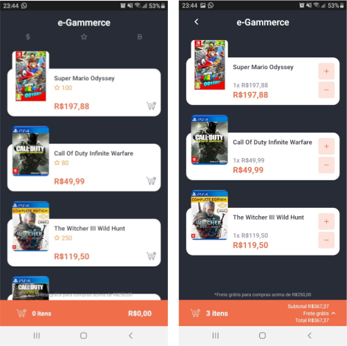

<div align="center">
  <a href="https://geovanijose.github.io/appegammerce/">
    
  </a>
</div>

# e-Gammerce :video_game:
App pessoal de uma loja de jogos

## Instalação :sparkles:
> Você precisa ter instalado em sua máquina o [Git](https://git-scm.com) e o [Yarn](https://yarnpkg.com/)
1. Clone este repositório
```bash
$ git clone https://github.com/GeovaniJose/appegammerce
```

2. Entre na pasta do repositório
```bash
$ cd appegammerce
```

3. Rode o comando para instalar as dependências
```bash
$ yarn
```

## Como rodar :heavy_check_mark:
> Passo a passo para rodar a aplicação
1. Rode o comando para iniciar a aplicação
```bash
$ yarn start
```

2. Rode o comando para android
```bash
$ yarn android
```

## Tecnologias :wrench:
> Tecnologias usadas no desenvolvimento do projeto:
- React Native
- TypeScript
- Yarn
- Styled-components
- AsyncStorage
- react-navigation
- react-native-svg
- Intl

## License :page_facing_up:
[MIT License](LICENSE)
